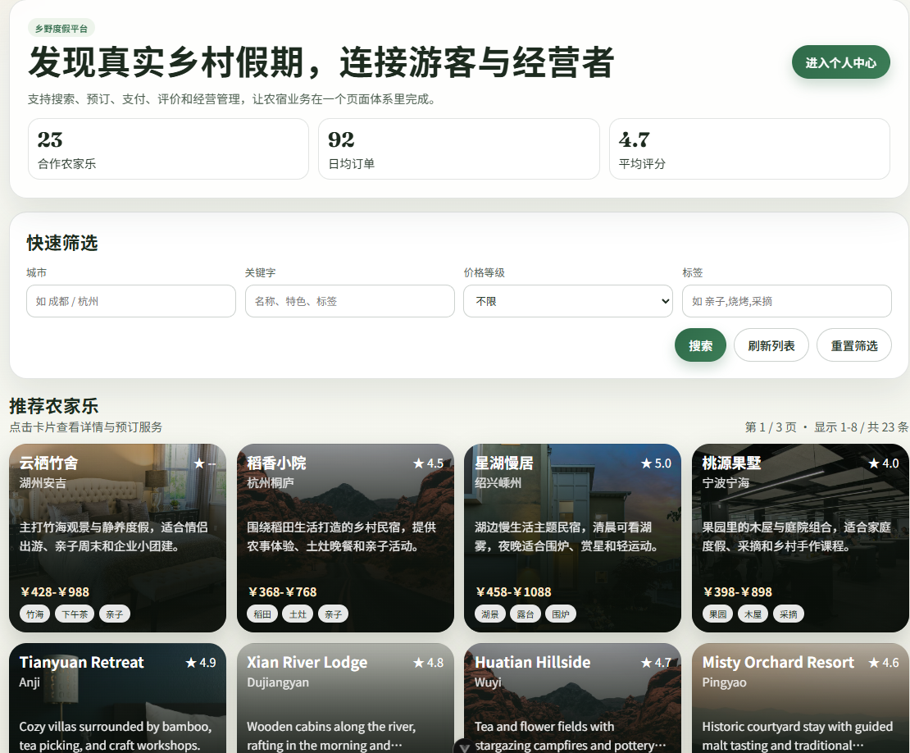
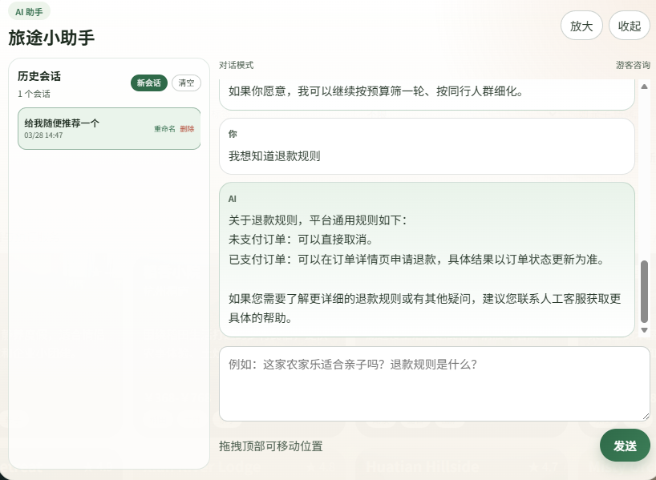
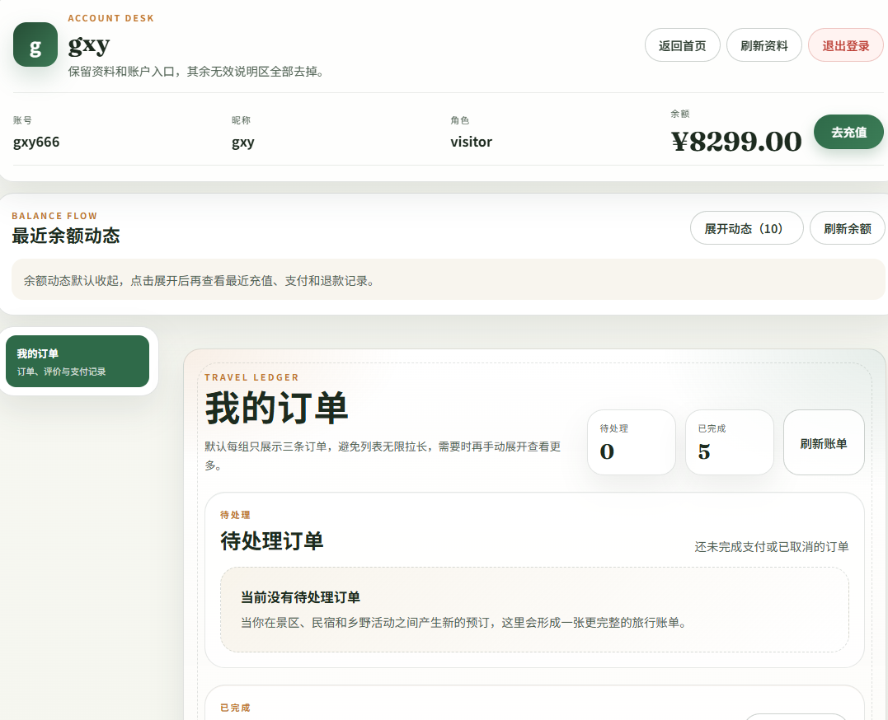
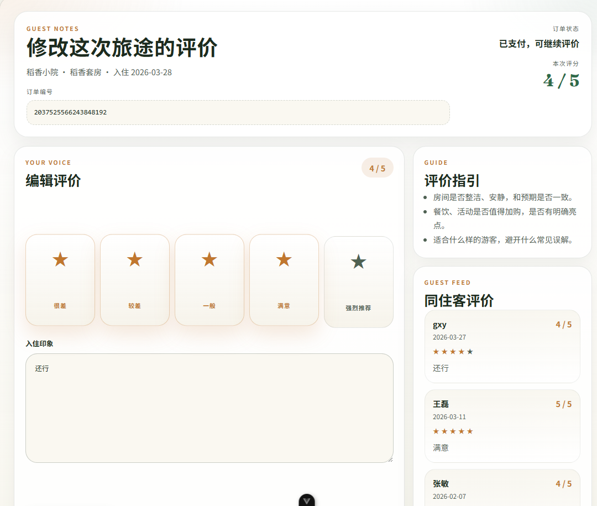
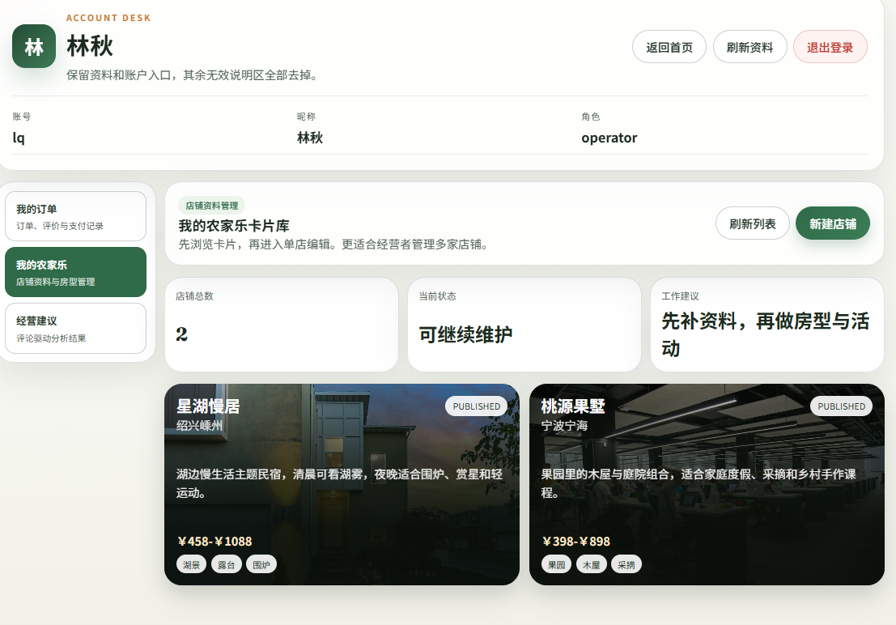
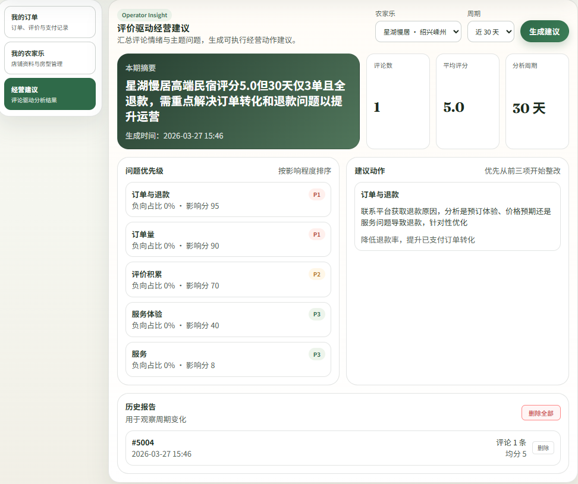
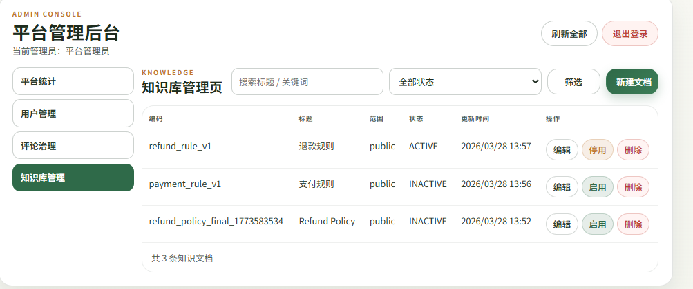

# Farmstay System

乡村民宿与农家乐服务平台后端项目，覆盖游客预订、余额支付、支付宝充值、评价、AI 助手、经营者运营建议和平台管理员治理等核心能力。项目当前已经跑通主要业务闭环，前端可直接按接口文档完成对接。

## 项目概览

系统围绕三类角色展开：

- 游客：搜索民宿、创建订单、余额支付、申请退款、提交评价、使用 AI 助手咨询规则和推荐
- 经营者：维护店铺与房型、查看订单、查看评价驱动的经营建议
- 管理员：用户管理、评论治理、知识库管理、平台统计

当前后端已支持：

- 民宿检索、详情、订单创建与余额支付
- 支付宝充值单创建、二维码支付、充值状态查询与余额入账
- 退款退回平台余额
- AI 助手多轮对话、FAQ 问答、推荐式问答、会话历史
- 经营者运营分析与建议报告生成
- 管理员后台接口与权限隔离

## 页面功能展示

### 1. 首页与民宿发现

首页聚合了平台介绍、筛选表单和推荐民宿卡片，支持按城市、关键词、价格等级和标签组合检索，适合作为游客端的统一业务入口。

对应能力：

- 民宿搜索与分页列表
- 卡片式展示民宿名称、城市、价格、标签和评分
- 从首页进入个人中心或下单流程

### 2. AI 助手

AI 助手页面支持历史会话、新建会话和对话式问答，可处理退款规则、推荐农家乐、解释平台能力等问题。

对应能力：

- FAQ 问答
- 推荐式问答
- 多轮上下文理解
- 会话历史管理

说明：当前 FAQ 检索为“问题改写 + title/content/keywords 关键词匹配”，推荐场景会在知识库未命中时继续尝试业务数据召回。

### 3. 游客个人中心

游客个人中心展示账号资料、账户余额、余额动态和订单列表，是游客侧的交易管理入口。

对应能力：

- 查询账户余额
- 查询余额流水
- 查询订单列表与状态
- 从余额区域进入充值流程

### 4. 支付宝充值

充值弹窗支持输入充值金额、展示当前余额、生成支付宝预下单二维码，并轮询充值状态，充值成功后余额同步更新。

对应能力：

- 创建充值单
- 返回支付宝 `qrCode`
- 查询充值状态
- 支付成功后写入余额与流水

当前实现模式：

- 订单支付：平台余额支付
- 充值渠道：支付宝沙箱/正式环境预留
- 退款路径：退回平台余额

### 5. 评价与修改评价

评价页面支持查看订单信息、查看同住客评价、提交或修改本次旅途评价。

对应能力：

- 订单维度评价
- 星级评分与文本评价
- 已有评价回显与修改
- 评价数据沉淀到经营建议分析链路

### 6. 经营者中心

经营者中心展示店铺卡片、状态、工作建议，并提供“我的农家乐”和“经营建议”两个主要经营视图。

对应能力：

- 店铺管理
- 店铺状态查看
- 订单与评价管理入口
- 经营建议入口

### 7. 经营建议

经营建议页面按农家乐和分析周期生成报告，展示摘要、问题优先级、建议动作和历史报告。

对应能力：

- 评论驱动的经营分析
- 建议报告生成与历史查看
- 问题优先级排序
- 建议动作输出

### 8. 管理员后台

管理员后台当前保持轻量范围，重点覆盖平台治理与统计，不直接参与游客或经营者的前台业务。

当前包含：

- 平台统计
- 用户管理
- 评论治理
- 知识库管理

知识库页面已区分：

- 启用/停用：状态切换
- 删除：真正物理删除

## 角色与权限

系统当前角色为：

- `visitor`
- `operator`
- `admin`

约束说明：

- 注册页只开放游客和经营者
- 管理员账号通过初始化脚本创建，不允许前台注册
- `admin` 主要通过 `/api/admin/**` 管理接口工作，不与经营者店铺经营职责混用

详细权限说明见：

- [system-and-permissions.md](E:\code\farmstay-system\docs\architecture\system-and-permissions.md)

## 技术栈

- Spring Boot 3
- MyBatis-Plus
- MySQL 8
- Sa-Token
- MiniMax / LLM 对话能力接入
- 支付宝预下单充值

## 文档索引

核心文档如下：

- [system-and-permissions.md](E:\code\farmstay-system\docs\architecture\system-and-permissions.md)
- [backend-api-guide.md](E:\code\farmstay-system\docs\api\backend-api-guide.md)
- [ai-capabilities-guide.md](E:\code\farmstay-system\docs\ai\ai-capabilities-guide.md)
- [payment-and-recharge-guide.md](E:\code\farmstay-system\docs\payment\payment-and-recharge-guide.md)
- [database-and-sql-guide.md](E:\code\farmstay-system\docs\database-and-sql-guide.md)

## 当前状态

项目当前已完成并跑通的主链路包括：

- 游客注册、登录、搜索、下单、余额支付、退款、评价
- 支付宝充值闭环
- AI 助手问答与推荐
- 经营者运营建议生成
- 管理员后台治理接口

当前 README 重点用于帮助阅读者快速理解系统能力，前后端详细对接以接口文档和数据库文档为准。
